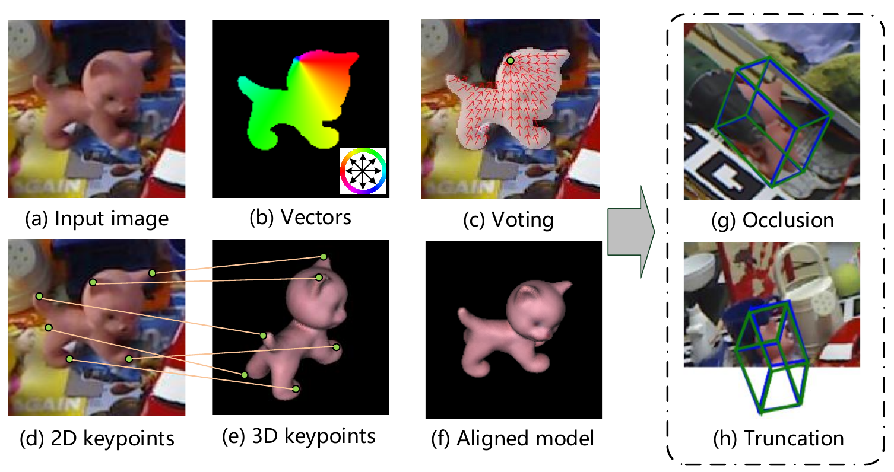
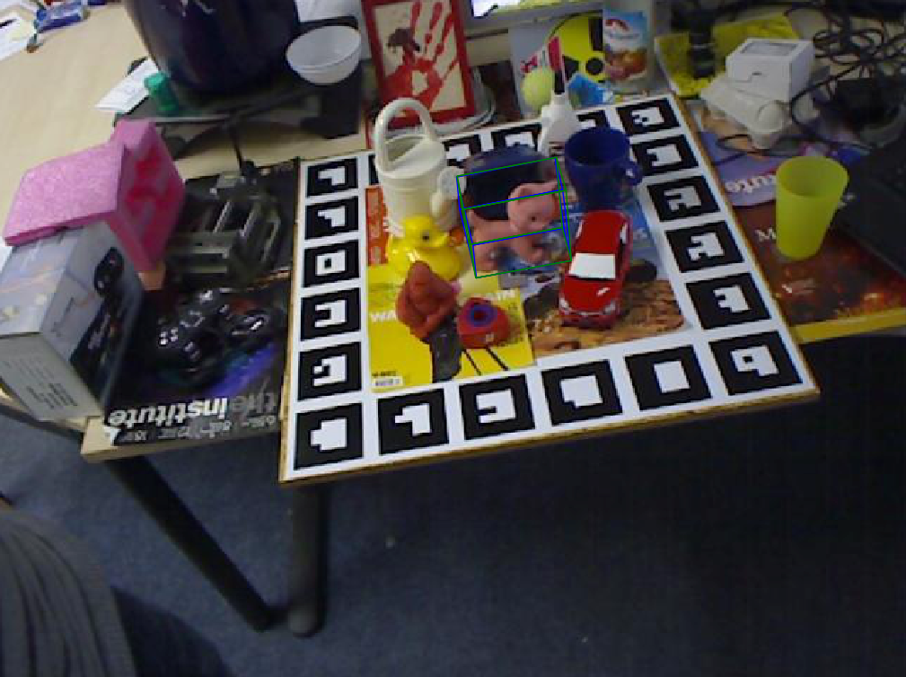

# PVNet: Pixel-wise Voting Network for 6DoF Pose Estimation



> [PVNet: Pixel-wise Voting Network for 6DoF Pose Estimation](https://arxiv.org/pdf/1812.11788.pdf)  
> Sida Peng, Yuan Liu, Qixing Huang, Xiaowei Zhou, Hujun Bao   
> CVPR 2019 oral  
> [Project Page](https://zju-3dv.github.io/pvnet)

Any questions or discussions are welcomed!

## Truncation LINEMOD Dataset

Check [TRUNCATION_LINEMOD.md](TRUNCATION_LINEMOD.md) for information about the Truncation LINEMOD dataset.

## Installation

The code uses PyTorch v0.4.1. After installing PyTorch, we need compile several files, which works fine with gcc 5.4.0.

1. Compile the Ransac Voting Layer

```
ROOT=/path/to/pvnet
cd $ROOT/lib/ransac_voting_gpu_layer
python setup.py build_ext --inplace
```

2. Compile some extension utils

```
cd $ROOT/lib/utils/extend_utils
```

Revise the `cuda_include` and `dart` in `build_extend_utils_cffi.py` to be compatible with the CUDA in your computer.

```
sudo apt-get install libgoogle-glog-dev
sudo apt-get install libsuitesparse-dev
sudo apt-get install libatlas-base-dev
python build_extend_utils_cffi.py
```

Add the `lib` under `extend_utils` to the LD_LIBRARY_PATH

```
export LD_LIBRARY_PATH=$LD_LIBRARY_PATH:/path/to/pvnet/lib/utils/extend_utils/lib
```

## Dataset Configuration

### Prepare the dataset

Download the LINEMOD, which can be found at [here](https://1drv.ms/u/s!AtZjYZ01QjphgQ56t4wCharVSfxL).

Download the LINEMOD_ORIG, which can be found at [here](http://campar.in.tum.de/Main/StefanHinterstoisser).

Download the OCCLUSION_LINEMOD, which can be found at [here](https://cloudstore.zih.tu-dresden.de/index.php/s/a65ec05fedd4890ae8ced82dfcf92ad8/download)

### Create the soft link

```
mkdir $ROOT/data
ln -s path/to/LINEMOD $ROOT/data/LINEMOD
ln -s path/to/LINEMOD_ORIG $ROOT/data/LINEMOD_ORIG
ln -s path/to/OCCLUSION_LINEMOD $ROOT/data/OCCLUSION_LINEMOD
```

### Compute FPS keypoints

```
python lib/utils/data_utils.py
```

### Synthesize images for each object

See [pvnet-rendering](https://github.com/zju-3dv/pvnet-rendering) for information about the image synthesis.

## Demo

Download the pretrained model of cat from [here](https://1drv.ms/u/s!AtZjYZ01QjphgQkDZa7fyvvaD7P6) and put it to `$ROOT/data/model/cat_demo/199.pth`. 

Run the demo

```
python tools/demo.py
```

If setup correctly, the output will look like



## Training and testing

### Training on the LINEMOD

Before training, remember to add the `lib` under `extend_utils` to the LD_LIDBRARY_PATH

```
export LD_LIDBRARY_PATH=$LD_LIDBRARY_PATH:/path/to/bb8-voter/lib/utils/extend_utils/lib
```

Training

```
python tools/train_linemod.py --cfg_file configs/linemod_train.json --linemod_cls cat
```

### Testing

We provide the pretrained models of each object, which can be found at [here](https://1drv.ms/f/s!AtZjYZ01QjphgQBQDQghxjbkik5f).

Download the pretrained model and move it to `$ROOT/data/model/{cls}_linemod_train/199.pth`. For instance

```
mkdir $ROOT/data/model
mv ape_199.pth $ROOT/data/model/ape_linemod_train/199.pth
```

Testing

```
python tools/train_linemod.py --cfg_file configs/linemod_train.json --linemod_cls cat --test_model
```

## Citation

If you find this code useful for your research, please use the following BibTeX entry.

```
@inproceedings{peng2019pvnet,
  title={PVNet: Pixel-wise Voting Network for 6DoF Pose Estimation},
  author={Peng, Sida and Liu, Yuan and Huang, Qixing and Zhou, Xiaowei and Bao, Hujun},
  booktitle={CVPR},
  year={2019}
}
```

