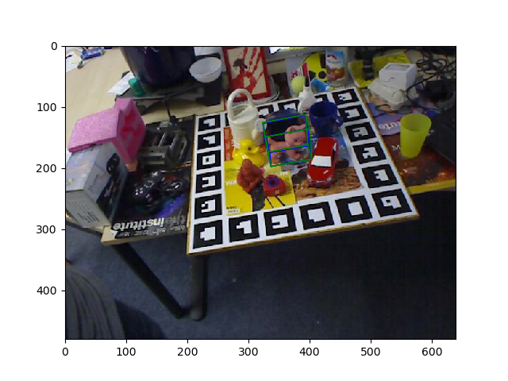

## How to run `tools/demo.py` from docker

_Steps verified on Ubuntu 18.04, Cuda 10.2 with a GTX1080 Ti card, and docker 19.03.2 installed on the host machine_

### Install docker

[From the docker site](https://docs.docker.com/install/linux/docker-ce/ubuntu/)

### Install nvidia-docker2

[Good How-To on medium](https://medium.com/@sh.tsang/docker-tutorial-5-nvidia-docker-2-0-installation-in-ubuntu-18-04-cb80f17cac65)

### Expand image size and set default runtime

The docker image created by `Dockerfile` is quite large, ~10GB, which means you may need to up the max image size allowed for docker.  Check [this link](https://guide.blazemeter.com/hc/en-us/articles/115003812129-Overcoming-Container-Storage-Limitation-Overcoming-Container-Storage-Limitation) for more info.  I have tried to streamline the insights from the article and to give the user what they need from it. 

Copy [daemon.json](./daemon.json) to your `/etc/docker/daemon.json`.  Stop/start docker:

```
sudo systemctl stop docker
# sudo rm -rf /var/lib/docker/*  ## IF YOU HAVE IMAGES, SAVE THEM IN A TARBALL ARCHIVE AND RESTORE AFTER DOING THIS
sudo systemctl start docker
```

_Note: you may or may not need to do the middle step.  If you have previously-built images, you will need to remove them before restarting docker for the updated max image size to take effect._

You can run `docker info` to verify the desired change took place:  Look for the line in the output:

```
...
Storage Driver: devicemapper
... some lines here ...
 Base Device Size: 21.47GB
... more lines follow ...
```

### Build the `pvnet` image

```
$ cd {path-to-pvnet}/docker
$ docker build --network=host -t pvnet-nvidia .
```

This will take awhile...

### Run the demo

#### Download the pre-trained model

Follow the steps from the [README](../README.md).  Note that the [`launch-docker.sh`](./launch-docker.sh) script handles mounting the pre-trained model's location on the host _inside_ of the running container instance that the script launches.

#### Launch the container

```
$[host] cd {path-to-pvnet}
$[host] ./docker/launch-docker.sh
$[container] source activate pvnet
$[container] cd /home/pvnet/pvnet
$[container] python tools/demo.py
```

You should see the desired figure pop-up:

<p align="center"> 

</p>

And that's it!  Once you exit the container, it will automatically be deleted and it's resources released.
